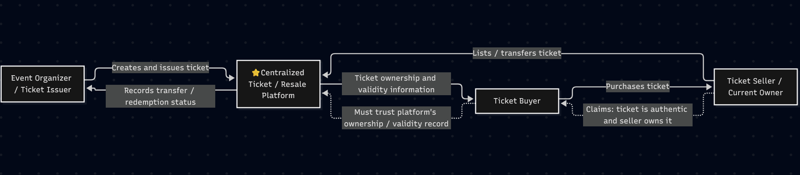
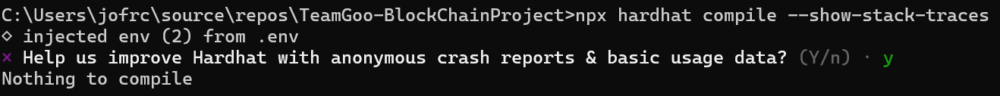
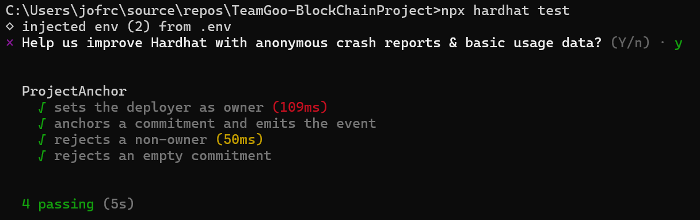
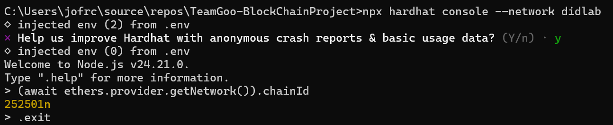

# M1 Project Proposal - Blockchain-Based Ticket Marketplace

## Part A — Problem Definition and Stakeholders

### A1 — Problem Statement
Ticket buyers and sellers in peer to peer resales must rely on ticket issuers or resale platforms to determine if a ticket is authentic, who owns it, whether it has been transferred, and if it has been redeemed. Buyers can have a hard time verifying these facts when such records are controlled by a centralized platform. This can lead to counterfeit or duplicated tickets, unaouthorized transfers, already redeemed tickets, financial loss, and conflicts between buyers and sellers. Ticiket issuers and resale platforms also must maintain accurate records as tickets move between owners and are redeemed.

### A2 — Stakeholders, Assets, and Transactions

| Category                        | Description                                                                                                                                                                                                                                                                                                                                                                                                                                                                                   |
| ------------------------------- | --------------------------------------------------------------------------------------------------------------------------------------------------------------------------------------------------------------------------------------------------------------------------------------------------------------------------------------------------------------------------------------------------------------------------------------------------------------------------------------------- |
| **Stakeholders**                | **Ticket issuer:** creates and authorizes tickets for an event. **Primary buyer:** purchases a ticket from the issuer and becomes its initial owner. **Secondary seller:** an existing ticket owner who lists a ticket for resale. **Secondary buyer:** purchases a ticket from an existing owner. **Event operator:** verifies and redeems tickets when attendees enter an event. **Marketplace operator:** provides the application through which users view, purchase, and resell tickets. |
| **Assets**                      | Event tickets, including their ownership, transfer history, authenticity/issuance status, and redemption status.                                                                                                                                                                                                                                                                                                                                                                              |
| **State-changing transactions** | **Ticket issuance:** initiated by the ticket issuer. **Primary ticket purchase:** initiated by a primary buyer. **Secondary listing:** initiated by the current ticket owner. **Secondary purchase:** initiated by a secondary buyer and results in ownership changing to the buyer. **Ticket redemption:** initiated by an authorized event operator when a ticket is used for entry.                                                                                                        |
| **Current intermediary**        | Ticket issuers and centralized ticketing or resale platforms maintain authoritative records of ticket ownership, authenticity, transfers, and redemption status.                                                                                                                                                                                                                                                                                                                              |
| **What can go wrong**           | A buyer may receive a counterfeit or duplicated ticket, purchase from someone who does not legitimately own the ticket, purchase a ticket that has already been redeemed, or encounter conflicting ownership records. These failures can cause financial loss and disputes between buyers, sellers, issuers, and marketplace operators.                                                                                                                                                       |

### A3 — Trust Boundary Diagram

## Part B — Suitability Gate

### B1 — Suitability Questions

**Q1. Do multiple parties who do not fully trust each other act on the same data?**

Yes. Ticket issuers, primary buyers, secondary sellers, and secondary buyers all interact with the same ticket ownership and transfer information. These parties may not fully trust one another, particularly when a ticket is resold and the buyer needs to determine whether the seller actually controls the ticket.

**Q2. Do multiple parties need to write to the shared data, rather than only read it?**

Yes. Different authorized parties need to cause different state changes. The ticket issuer creates and authorizes tickets, buyers acquire tickets, current owners initiate secondary-market sales, buyers complete purchases, and an authorized event operator records redemption when a ticket is used for entry.

**Q3. Is the intermediary's cost, delay, failure, or control itself part of the problem?**

Yes. The current process relies on a ticket issuer or centralized resale platform to maintain authoritative records of ticket ownership, transfers, and redemption. This creates a dependency on the intermediary because buyers and sellers may not be able to independently verify those records when ownership is disputed or the intermediary's system is unavailable or does not provide sufficient information.

**Q4. Does someone need to verify a claim without trusting the claimant or their private system?**

Yes. A secondary-market buyer needs to determine whether the seller actually controls the ticket and whether it has already been transferred or redeemed. A publicly verifiable record can allow the buyer to check the ticket's recorded ownership and transfer history without relying solely on the seller's claim or a private database.

**Q5. Does the record need to remain tamper-evident after the fact?**

Yes. Ticket ownership and transfer records may need to be reviewed later to resolve disputes involving duplicate sales, unauthorized transfers, or redemption. Maintaining a tamper-evident history allows participants to determine whether recorded ownership and transfer events have been altered.

### B2 — Disqualifiers

**D1. Does the system require confidential content to be stored on chain?**

**State: No.** Confidential information such as buyer or seller names, contact information, payment information, and private ticket details will remain off chain. The on-chain record will contain only the information necessary to manage and verify ticket ownership, transfers, authorization, and redemption status, without storing personal identifiers.

**D2. Does the system require throughput or finality beyond approximately 2-second blocks?**

**State: No.** Ticket issuance, purchases, resales, transfers, and redemption do not require extremely high transaction throughput or sub-second finality for the proposed application. 

**D3. Does the system require large data to be stored on chain?**

**State: No.** Large or detailed ticket content, including ticket files and QR codes, will remain off chain. The on-chain system only needs the small amount of state required to represent ticket ownership, transfers, authorization, and redemption status.

**D4. Do all critical facts enter through a single unverifiable reporter?**

**State: Partially.** The critical facts enter the system through different authorized participants. **Ticket creation and initial issuance** are reported by the ticket issuer, who could falsely create or authorize a ticket; the blockchain cannot independently determine whether the issuer actually has the authority to issue the real-world ticket. **Ownership changes** are initiated by the current ticket owner and completed by the buyer; a compromised owner account or authorized participant could cause an unauthorized transfer, although the contract can reject transfers from addresses that are not the recorded owner. **Redemption status** is reported by an authorized event operator or scanning system; a compromised scanner or operator could falsely report that a ticket was redeemed, and the blockchain cannot independently determine whether the physical ticket was actually scanned. The design therefore limits these risks through authorization and makes the resulting records publicly verifiable, but it cannot eliminate the trust required for facts that originate outside the blockchain.

**D5. Does the business process require records to be reversible or erasable?**

**State: No.** Ticket ownership and transfer history should remain available for later verification and dispute resolution. If a correction is necessary, it should be represented by a new authorized transaction or state change rather than deleting or rewriting the previous history.

### B3 — Suitability Verdict

**Verdict: PROCEED WITH REDESIGN**

The ticket marketplace is suitable for a blockchain-based design when the blockchain is limited to shared records that multiple parties need to verify. The design can represent each ticket as a unique on-chain asset, allow authorized participants to issue and transfer tickets, and allow buyers and sellers to interact through primary and secondary marketplaces. Private information and large ticket content will remain off chain. The design must also recognize that blockchain cannot independently verify physical events such as a ticket being scanned; instead, redemption will be recorded as a report from an authorized event operator or scanning system.

A third party with no access to any participant's private systems can verify **the recorded ownership, transfer history, transfer authorization, and redemption status of a ticket** by **examining the publicly verifiable on-chain ticket records and the authorized transactions that changed them**.

## Part C — Technical Scope and Data Model

### C1 — On-Chain and Off-Chain Data

| Data                         | On Chain                                                                         | Off Chain                                                          | Justification                                                                                                                                      |
| ---------------------------- | -------------------------------------------------------------------------------- | ------------------------------------------------------------------ | -------------------------------------------------------------------------------------------------------------------------------------------------- |
| Ticket/NFT identifier        | Unique token ID representing each ticket                                         | Full ticket description and event details                          | The token ID provides a small, unique on-chain reference for each ticket without storing the full ticket content on chain.                         |
| Ticket ownership             | Current owner's wallet address                                                   | Personal information associated with the owner                     | Ownership must be publicly verifiable through the NFT, while names, emails, and other personal identifiers remain off chain.                       |
| Ticket issuance              | Issued token and authorized issuer address                                       | Additional event and ticket information                            | The blockchain can record that an authorized issuer created a specific ticket/NFT.                                                                 |
| Primary-market listing       | Ticket/NFT identifier, seller/issuer address, listing price, and listing status  | Additional marketplace information                                 | The marketplace needs the listing state to determine which tickets are available for primary purchase.                                             |
| Secondary-market listing     | Ticket/NFT identifier, current seller address, listing price, and listing status | Additional marketplace information                                 | The current owner must be able to list an owned ticket for resale and buyers must be able to verify the listing and seller through on-chain state. |
| Transfer history             | Ownership transfers and transaction timestamps                                   | Private transaction details and personal information               | Ownership changes should remain tamper-evident and independently verifiable.                                                                       |
| Redemption status            | Redemption state, timestamp, and authorized redemption event                     | Scanner data and other event-system details                        | The blockchain can preserve the recorded redemption status while the event scanning system remains the source of the redemption report.            |
| Ticket content               | None                                                                             | Ticket file, barcode, QR code, and other detailed ticket content   | Large or sensitive ticket content does not need to be stored publicly on chain.                                                                    |
| Buyer and seller information | None                                                                             | Names, emails, payment information, and other personal information | Personal identifiers and private information must not be stored on chain.                                                                          |

### C2 — Contract Sketch

The smart contract will represent each event ticket as a unique NFT and manage its issuance, ownership, primary-market sale, secondary-market resale, and redemption state. The contract will maintain the public state needed to verify ticket ownership and marketplace activity while keeping personal information and large ticket content off chain.

**State and data types:**

* Ticket/NFT token ID: `uint256`
* Current owner: wallet `address`
* Ticket status: an enum representing states such as active and redeemed
* Primary-market listing information: ticket price and listing status
* Secondary-market listing information: seller, ticket price, and listing status
* Redemption status: a boolean or status value indicating whether the ticket has been recorded as redeemed
* Authorized participants: addresses representing the ticket issuer and approved event operators
* Ownership and transfer history: represented through NFT ownership changes and blockchain transaction/event history

**State-changing functions and callers:**

* `mintTicket()` — called by an authorized ticket issuer to create a ticket/NFT.
* `buyPrimaryTicket()` — called by a buyer to purchase an available ticket from the primary marketplace.
* `listTicket()` — called by the current NFT owner to place a ticket on the secondary marketplace.
* `cancelListing()` — called by the current owner to remove an active secondary-market listing.
* `buySecondaryTicket()` — called by a buyer to purchase a listed ticket from the current owner and transfer NFT ownership.
* `redeemTicket()` — called by an authorized event representative or scanning system to record that a ticket has been reported as redeemed.
* Authorization functions — called by an authorized administrator to add or remove approved participants.

Users will connect a MetaMask wallet to the web application to identify their wallet and sign transactions that purchase, list, or transfer tickets. MetaMask does not store personal ticket information; it provides the wallet used to authorize blockchain transactions.

**Events:**

* `TicketMinted` — announces the creation of a ticket/NFT and its authorized issuer.
* `PrimaryTicketSold` — announces the initial sale of a ticket to a buyer.
* `TicketListed` — announces that an owner has listed a ticket for secondary-market resale.
* `TicketListingCancelled` — announces that an active resale listing was cancelled.
* `SecondaryTicketSold` — announces the resale of a ticket and its new owner.
* `TicketRedeemed` — announces that an authorized participant recorded the ticket as redeemed.
* Authorization events — announce changes to authorized participants.

Events should use indexed parameters where useful so that ticket activity can be efficiently located and independently verified.

### C3 — Scope Commitment

**Minimum viable by Week 12:** The team will implement and test the core ticket NFT and marketplace smart contract. The system will allow an authorized issuer to create tickets, a buyer to purchase a ticket through the primary marketplace, an owner to list a ticket for secondary-market resale, and another buyer to purchase the listed ticket. The contract will maintain NFT ownership and transfer history, restrict state-changing operations to authorized participants where required, and allow an authorized event operator or scanning system to record redemption status. The core contract will be deployed and tested on DIDLab.

**Target by Week 14:** The team will have a publicly accessible web application connected to the deployed smart contract. Users will be able to connect MetaMask, view available primary and secondary tickets, purchase tickets, list owned tickets for resale, view ticket ownership and transfer history, and view recorded redemption status. The application will interact with real on-chain state on DIDLab rather than using a mock or simulated blockchain.

Explicitly out of scope:

Real-world credit/debit card or fiat payment processing.
Integration with an actual commercial ticket issuer or ticketing provider.
Storage of names, emails, payment information, or other personal identifiers on chain.
Storage of large ticket files, QR codes, or private ticket information on chain.
Replacement of physical venue ticket-scanning infrastructure.
Independent verification that a physical ticket was actually scanned.
Guaranteeing the truth of real-world information reported by an authorized issuer or event operator.
A production-scale ticketing system capable of supporting commercial event volumes.

## Part D — Repository / Compiled Contract

### D1 — Repository Foundation

The project repository is hosted on GitHub and contains the files and directories needed for Solidity development, automated testing, documentation, deployment, and the future frontend application.

**Repository:** `https://github.com/lc6cm/TeamGoo-BlockChainProject`

The repository will be used for version control throughout development, with each team member making substantive commits under their own account. The submitted `docs/PROPOSAL.md` will match the proposal submitted for the milestone.

**Graded commit hash:** 2bf16fb

### D2 — Team Contributions

| Team Member    | Number of Substantive Commits | Contribution                                                                                                                                                               |
| -------------- | ----------------------------: | -------------------------------------------------------------------------------------------------------------------------------------------------------------------------- |
| Joey Contreras |            3 | Established the Solidity project foundation, implemented and tested the M1 contract scaffold, collected DIDLab/Hardhat evidence, and maintained the AI development record, pushed initial website content|
| Lupe Campos    |            3 | Developed and maintained the project proposal documentation and contributed to repository and project planning, checkpoint report updating                                                            |

Commit counts will be based on substantive commits made under each team member's own GitHub account. The final submission will use the repository history to verify these contributions.

### D3 — Compiled Contract and Passing Tests

The current M1 contract scaffold and its automated tests are located in the `contracts/` and `test/` directories.

The M1 scaffold demonstrates the required contract-development foundation, including on-chain state, restricted state-changing access, a custom error, an event with indexed parameters, and automated success and failure tests. The ticket NFT and marketplace functionality will be developed from this foundation in later milestones.

**Compile Succeeded**

**All Tests Passing**

**DIDLab Chain ID**

The read-only chain check confirmed that the target DIDLab network uses chain ID `252501`.

## Part E — Milestones and Team Charter

### E1 — Project Milestones

| Milestone                                     | Week | Planned Deliverable                                                                                                                                                                                                                                                                                                                                                         | Owner                                                                                                        |
| --------------------------------------------- | ---: | --------------------------------------------------------------------------------------------------------------------------------------------------------------------------------------------------------------------------------------------------------------------------------------------------------------------------------------------------------------------------- | ------------------------------------------------------------------------------------------------------------ |
| **M2 — Deployed Contract**                    |    6 | Deploy the initial ticket NFT/ownership contract to DIDLab, verify the deployment, and demonstrate ticket creation and on-chain ownership. Complete the required contract tests and collect deployment evidence.                                                                                                                                                            | Joey — DIDLab operation and evidence; Lupe — repository management and contract review                       |
| **M3 — Vertical Slice**                       |    8 | Demonstrate the core primary-market workflow: an authorized issuer creates a ticket/NFT, a buyer connects a wallet and purchases the ticket, and the resulting NFT ownership can be read and verified on chain. Establish the initial frontend-to-contract workflow and on-chain/off-chain data architecture.                                                               | Joey — contract deployment, testing, and evidence; Lupe — repository integration and workflow implementation |
| **M4 — Security Review and Feature Complete** |   12 | Complete the core marketplace features, including NFT ownership, primary purchases, secondary-market listings and purchases, authorization controls, redemption status, ownership/transfer history, and validation of invalid or unauthorized operations. Complete a security-focused review and ensure the automated test suite covers the main success and failure cases. | Joey — DIDLab testing and evidence; Lupe — security review and repository integration                        |
| **M5 — Release Candidate and Freeze**         |   14 | Produce a publicly accessible release candidate with MetaMask integration, primary and secondary ticket marketplaces, on-chain ticket ownership and transfer history, recorded redemption status, documentation, deployment information, and final test results. Resolve known issues and freeze the feature set for the final demonstration.                               | Joey — final deployment and evidence; Lupe — release coordination and repository finalization                |

### E2 — Team Charter

The team charter is maintained in `docs/TEAM_CHARTER.md`. It defines the team's roles and responsibilities, communication and response expectations, regular meeting schedule, and consequences for missed commitments.

The team uses the charter to assign responsibility for repository management, DIDLab operation and evidence collection, project implementation, and final review. Team members are expected to communicate when they cannot complete an assigned task and to coordinate changes through the shared Git repository.
